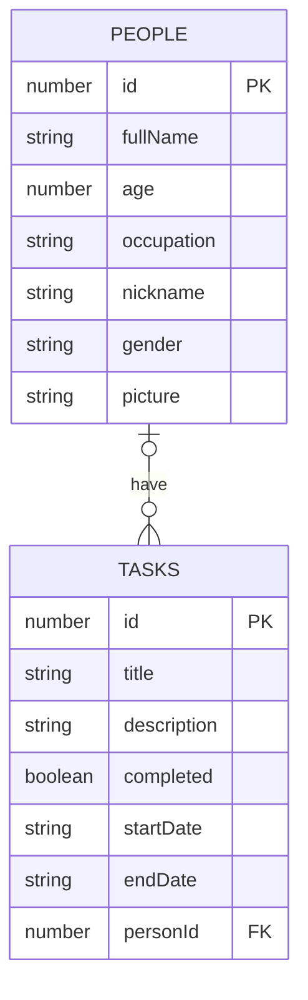

This frontend developer test is a coding task that will evaluate your proficiency in HTML, CSS, JavaScript, and React.js frontend framework, as well as your ability to write clean, efficient code that meets the requirements of the task. Successful candidates will be able to demonstrate a strong understanding of frontend development concepts and practices, and be able to apply that knowledge in a practical setting.

## Setup

1. Fork this repository to your GitHub account, so you can commit and push your changes to your copy.
2. `git clone` your fork and install the project dependencies with `npm install`
3. Init dev mode with `npm run dev`. A Next.js application will be running on port 3000 and a fake API will be running on port 3001. The fake API is powered by json-server. Documentation is available on their [GitHub page](https://github.com/typicode/json-server).

## Requirements

You'll be creating a `static website` with Next.js that uses an API to read and update data. Note that you can use any third-party library to fulfill the requirements. This is also valid for styling.

The following is the list of requirements you must complete:

**Home page**
- [ ] When the user visits the homepage of the app, a list of people is displayed. Each list item must show the person's picture, full name, age, and occupation. By default, the people are listed in order from the youngest to the oldest. This ordering can be achieved by sorting the list of people by their age in ascending order, so that the youngest person is shown first and the oldest person is shown last. This default ordering can be changed by the user, if desired, using a sorting control on the page.
- [ ] When the user clicks on a list item, they are redirected to the profile page at `/profile/<id>`, where `<id>` is a dynamic value representing the unique identifier of the person.

**Profile page**
- [ ] When the user visits the `/profile/<id>` page, the app must display all of the information related to the person with a matching `id`. This information should include the person's picture, full name, age, and occupation, as well as any additional details that may be available.
- [ ] On the profile page, there should be a link that allows the user to navigate to the profile editing page at `/profile/<id>/edit`. This link can be placed in a prominent location on the page, such as near the top or in a menu, to make it easy for the user to find. When clicked, the link should redirect the user to the profile editing page, where they can modify the information associated with the person identified by the `<id>` value in the URL.
- [ ] On the profile page, the user must be able to see a list of tasks attached to the current person's profile. Each task in the list must include its title, description, and a status indicating whether it has been completed or not. This information can be displayed in a table or as a list of items, with each item showing the relevant details for a single task.
- [ ] On each task list item, there must be a button that can be used to switch the completed state of the task. This button should be labeled appropriately to indicate its function, such as "Mark as completed" or "Mark as not completed", depending on the current state of the task. When clicked, the button should change the completed status of the task and update the display accordingly, so that the user can see the current status of the task at a glance.
- [ ] On each task list item, there should be a link that allows the user to navigate to the task editing page at `/tasks/<id>/edit`. This link can be placed in a prominent location on the task list item, such as near the title or description of the task, to make it easy for the user to find. When clicked, the link should redirect the user to the task editing page, where they can modify the information associated with the task identified by the `<id>` value in the URL. The task editing page should include a form that allows the user to edit the title, description, and completed status of the task, as well as any other relevant details. The user should be able to save their changes to the task by submitting the form, or cancel the editing process and return to the previous page.

**Profile edit page**
- [ ] When the user visits the `/profile/<id>/edit` page, the app must display a form containing the existing information for the person identified by the `<id>` value in the URL. This form should be pre-filled with the current values for each property, such as the person's picture, full name, age, and occupation. The user should be able to modify any of these properties by changing the values in the form fields. All of the properties are required, so the user must provide a value for each one in order to successfully save the changes to the person's profile.

Note that the picture field is a URL pointing to an image, rather than the image file itself. The user should enter the URL of the image they want to use for the person's profile picture, and the app will display the image on the profile page using this URL. The user may need to upload the image to a hosting service or image sharing site in order to obtain a URL that can be used in this field.

**Task edit page**
- [ ] When the user visits the `/tasks/<id>/edit` page, the app must display a form containing the existing information for the task identified by the `<id>` value in the URL. This form should be pre-filled with the current values for each property, such as the task's title, description, and completed status. The user should be able to modify any of these properties by changing the values in the form fields. All of the properties are required except for the `endDate` property, which is optional. The user must provide a value for each required property in order to successfully save the changes to the task.

If the task has an `endDate` property that is set to a day before the current date, the task will be automatically marked as completed. This can be useful for tasks that have a fixed completion date, as it allows the app to track the progress of the task and mark it as complete when the end date is reached. The user can still manually change the completed status of the task if desired, but the app will automatically update the status based on the value of the endDate property. If the task does not have an endDate property, or if the property is set to a date in the future, the completed status of the task will not be automatically updated.

**Bonus**

**Note:** these requirements are not mandatory to submit the test.

- [ ] To add a new person, the app must have a page that allows the user to enter the necessary information and create a new profile. This page can be located at `/profile/new`.

On this page, the app should display a form that allows the user to enter the person's picture, full name, age, and occupation. These fields are all required, so the user must provide a value for each one in order to successfully save the new profile. The form should also include a submit button that the user can click to create the new profile and save the entered information.

Additionally, the app should provide navigation options that allow the user to easily return to the homepage or other relevant pages, such as the profile page for the new person once it has been created. This can be achieved using links or other navigation controls on the page.

- [ ] To add a new task, the app must have a page that allows the user to enter the necessary information and create a new task. This page can be located at `/tasks/new`.

On this page, the app should display a form that allows the user to enter the task's title, description, and completed status. These fields are all required, so the user must provide a value for each one in order to successfully save the new task. Additionally, the form should include a field for the `endDate` property, which is optional but can be useful for tasks with a fixed completion date.

The form should also include a field or control that allows the user to specify the person to whom the task should be attached. This field should allow the user to select the person from a list of existing profiles. Once the user has entered all of the necessary information and selected the person to whom the task should be attached, they can click the submit button to create the new task and save the entered information.

Additionally, the app should provide navigation options that allow the user to easily return to the homepage or other relevant pages, such as the task list for the person to whom the new task is attached. This can be achieved using links or other navigation controls on the page.

## DB Schema

The following is the database schema:

